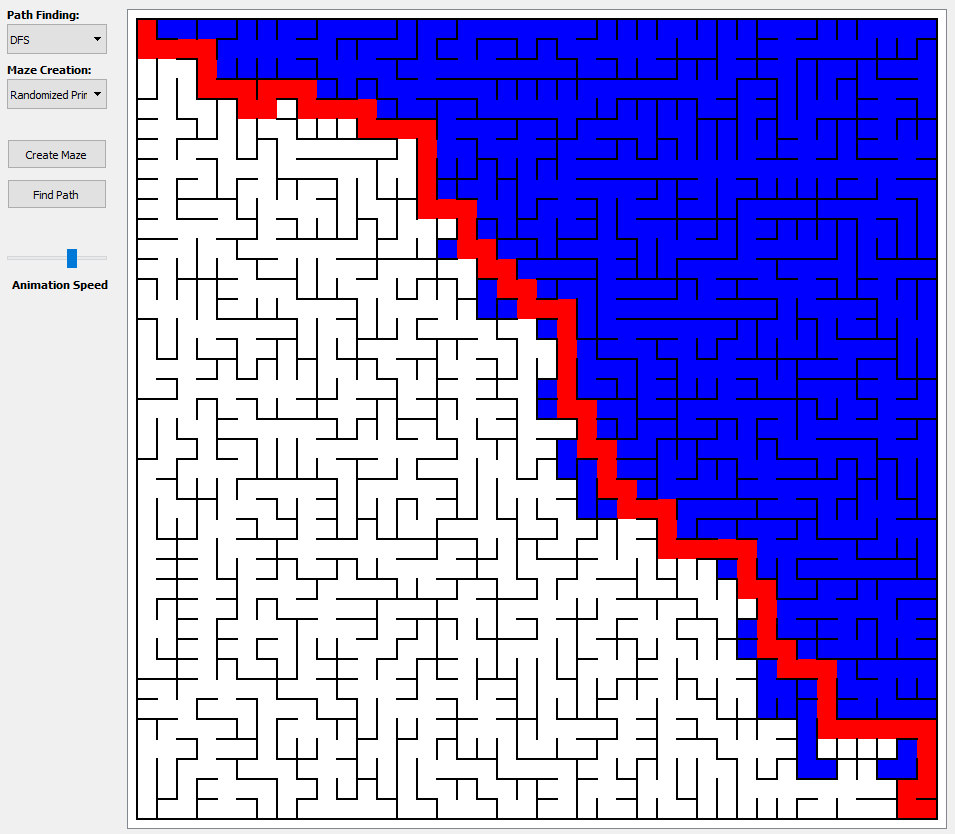

# Pathfinding Visualizer

## About
A program that visualizes how different maze creation and 
pathfinding algorithms work.

## Illustration
User interface of the program. \
The area in blue shows the area that the pathfinding 
algorithm covered before it found the path.

## Technologies

[PyQt5](https://pypi.org/project/PyQt5/)
